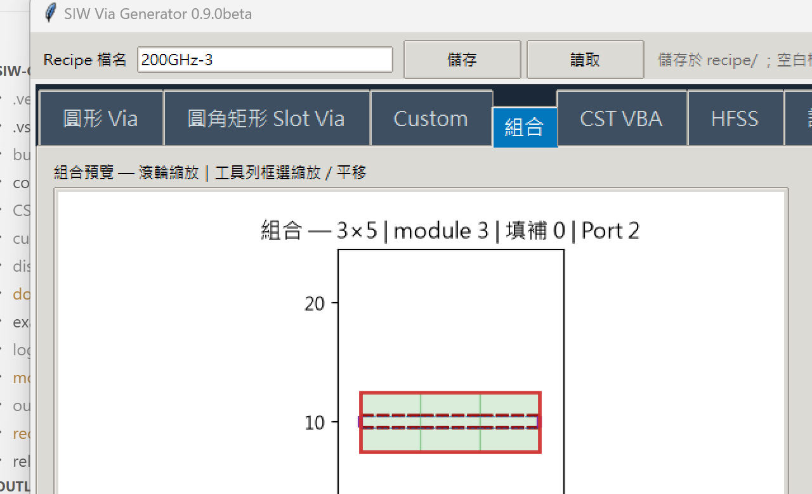
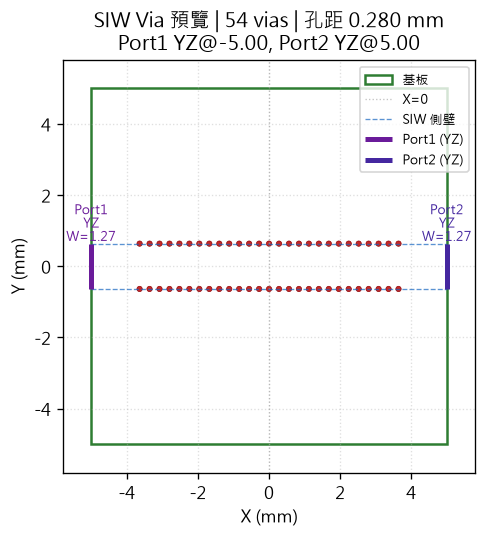
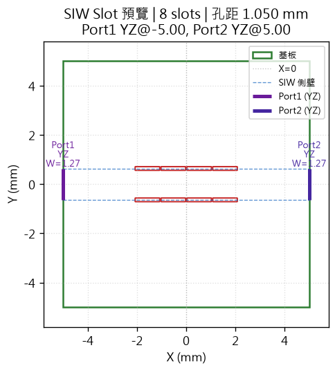
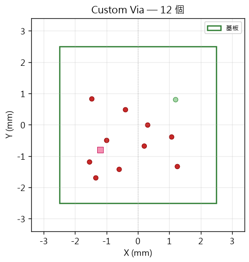
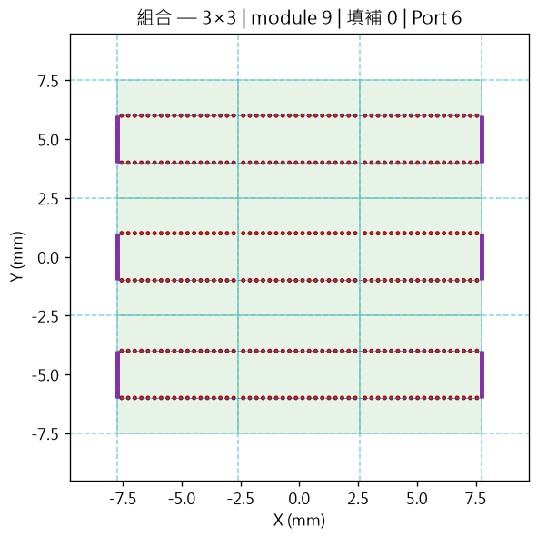

# SIW Generator

Python GUI 專案，用於設計 SIW Via 圍牆、Custom 模組與組合版面，並輸出 CST / HFSS 模擬檔案。

<!-- AUTO_SCREENSHOTS_START -->
**版本 0.9.1beta** — 圖形化設計 SIW Via 圍牆、Custom 模組與 M×N 組合版面，可輸出 **CST**（DXF / STL / VBA）、**HFSS** VBScript 與參數報告。

| 分頁 | 功能 |
|------|------|
| **圓形 Via** | 圓柱 Via 圍牆、Port、XY/YZ 預覽、CST 輸出 |
| **圓角矩形 Slot Via** | 跑道形 Slot 孔 SIW 設計 |
| **Custom** | 滑鼠放置圓/方/Slot 孔；貫孔 / top金屬 / bot金屬；模組存於 `module/` |
| **組合** | 平鋪模組、填補、Port、組合級 CST 套件 |
| **CST VBA / HFSS** | 預覽與複製模擬巨集 |

### 主視窗 — Recipe 與分頁



頂部 **Recipe** 列可儲存／讀取全部參數；分頁切換圓形、Slot、Custom、組合與模擬輸出。

### 圓形 Via — XY 預覽



依頻率、孔徑、孔距與 SIW 寬度自動排列圓柱 Via，並顯示 Port 位置。

### 圓角矩形 Slot Via



圓角矩形 Slot 孔沿 X 排列，適用於 Slot 型 SIW 側壁。

### Custom Via 模組



自由放置 Via；**貫孔**（紅）、**top金屬孔**（淺綠）、**bot金屬孔**（粉紅）可區分銅層挖孔。

### 組合版面



將 `module/` 模組平鋪至網格，支援旋轉、鏡射、填補與 Port 定義。

> 截圖由 `python scripts/generate_guide_images.py` 自動產生。
<!-- AUTO_SCREENSHOTS_END -->

## 環境

- Python 3.11+（建議使用 Anaconda `base` 環境）
- 解譯器路徑：`C:\ProgramData\anaconda3\python.exe`

在 Cursor 中開啟此資料夾後，應自動選用 Anaconda base。若未選中，執行 `Python: Select Interpreter` 並選擇 `base (conda)`。

## 安裝（開發模式）

```powershell
cd D:\python\siw-generator
pip install -e .
```

## 執行

```powershell
python -m siw_generator --gui
python -m siw_generator --name demo
python -m siw_generator --name demo --output output\result.json
```

或使用安裝後的指令：

```powershell
siw-generator-gui
siw-generator --name demo
```

## 更新 README 截圖

```powershell
python scripts/generate_guide_images.py
```

會擷取主視窗畫面、各分頁預覽圖，並寫入本檔 `<!-- AUTO_SCREENSHOTS_START -->` 區塊。

## 專案結構

```
siw-generator/
├── src/siw_generator/   # 核心程式與 GUI
├── docs/                # 使用說明與截圖
├── module/              # Custom / RSIW / SSIW 模組 JSON
├── combination/         # 組合版面存檔
├── recipe/              # Recipe 設定檔
├── scripts/             # 建置與截圖腳本
├── pyproject.toml
└── requirements.txt
```

## 說明文件

- [使用說明](docs/USER_GUIDE.md)
- [開發紀錄](docs/AGENT_HISTORY.md)
